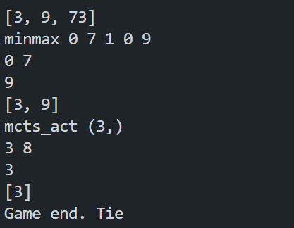
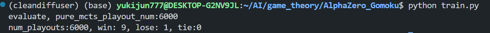
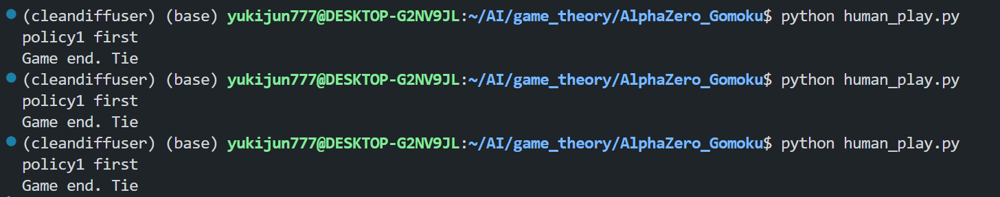

最初实验训练3000步，经过2850局，AlphaZero VS pure_MCTS 4000 取得9胜1负。

12-04 22:30
推理观察：训练出来的AI只会最简单的赢游戏的方式，不会防守和跟对手对弈，水平很低。
改进方向：self-play，训练的时候加入游戏规则（禁手之类的，参考ui.py），推理的时候也用MCTS，而不是直接用训练的policy。×
It turns out that author had done MCTS during inference, so we dont need to implement it, but I can still try to train longer and tune the hyperparameters, n_playout and more n_playout in the test...
according to my observation, we need some rules to improve the performance, or we have to get a more powerful and accurate policyvalue_net!
大规模 MCTS 生成复杂推理样本 + 高质量数学代码类数据 + RM/规则/编译器反馈 + SFT/Off-Policy RL 类训练

12-05 14:52-》16:31
改n_row（5）和playout（400）实验开始。
训练的很慢而且没有效果，quitted the training.

12-05 16:41-》23:00
参数、修改和其他配置：改n_row（5）playout为400，lr为1e-3
实验结果：棋力明显上升，聪明了一些，不过最后还是不敌人类，不过会出现双方都没有地方可下的情况，需要加入规则判断。
其他改进方向：训练时加入规则，让规则指导; 用RL做策略提升（需要有环境，env可参考ui.py）；用Diffusion模型（暂不知道怎么融合）
先思考怎么用规则和传统MINMAX博弈算法提升效果，目的是不需要训练太久就出效果，效果得打败MINMAX博弈算法。

12-06 13:38-》14：56
参数配置： 'board_width': 9,'board_height': 9,'init_model':None,'use_gpu':True,'n_playout':400,'game_batch_num':1500,'n_in_row':5, 'lr':1.5e-3
学不出来东西已停止

12-06 15：00-》20：30
参数配置： 'board_width': 9,'board_height': 9,'init_model':None,'use_gpu':True,'n_playout':400,'game_batch_num':1500,'n_in_row':5, 'lr':3e-3
未测试重新训练

12-07 10:43-》
{
        'board_width': 9,'board_height': 9,'init_model':None,'use_gpu':True,'n_playout':400,'game_batch_num':1500,'n_in_row':5, 'lr':3.5e-3
    }
实验结果：模型表现还可以，人类一不留神就会输，但是有时候会很蠢

12-19 21_50->22:50
add rl trainging(reinforce algorithm)
{
        'board_width': 6,'board_height': 6,'init_model':None,'use_gpu':True,'n_playout':400,'game_batch_num':1500,'n_in_row':5, 'lr':2.5e-3
    } self.rl_coff:0.15
实验结果：训练效果不好，训练loss很不稳定

12-20 10:12->22:50
{
        'board_width': 6,'board_height': 6,'init_model':None,'use_gpu':True,'n_playout':400,'game_batch_num':1500,'n_in_row':5, 'lr':2e-3
    } self.rl_coff:0.1
实验结果：训练效果不好，训练loss很不稳定，容易平局

12-20 14:57-》18~19
    kwargs = {
        'board_width': 9,'board_height': 9,'init_model':None,'use_gpu':True,'n_playout':400,'game_batch_num':1500,'n_in_row':5, 'lr':2e-3
    }
实验结果：报错断掉训练，只训练了612步，但是效果明显要比之前强了

12-22 17:23-》12-23 17:45
    kwargs = {
        'board_width': 9,'board_height': 9,'init_model':None,'use_gpu':True,'n_playout':400,'game_batch_num':1500,'n_in_row':5, 'lr':2e-3, mix_stratgy:0.15
    }
with RL(0.15) and minmax stratgy(0.15)
实验结果：效果不错，知道攻守，目前最优模型num_playouts:5000, win: 10/9, lose: 0/1, tie:0

12-23 21:21-》12-24 9:12
kwargs = {
        'board_width': 9,'board_height': 9,'init_model':None,'use_gpu':True,'n_playout':400,'game_batch_num':2000,'n_in_row':5, 'lr':2.5e-3/3.5e-3, 
    }
without RL and minmax stratgy
训练没有改进的模型，训练效果不好，训练loss很不稳定，而且没有下降（已训练7h），调整学习率

12-24 9:14-》12-24 19:00
kwargs = {
        'board_width': 9,'board_height': 9,'init_model':None,'use_gpu':True,'n_playout':400,'game_batch_num':2000,'n_in_row':5, 'lr':2e-3, 
    }
without RL and minmax stratgy
loss开始有明显下降了，继续观察后续，效果一般num_playouts:3000, win: 6/8, lose: 4/2, tie:0

mcts_player = MCTSPlayer(best_policy.policy_value_fn, c_puct=5, n_playout=1500)再测试时可以改变n_playouts的值对比使用不同n_playouts（每下一步棋MCTS模拟的次数）的效果

12-24 20:04-》12-25 4:38
kwargs = {
        'board_width': 9,'board_height': 9,'init_model':None,'use_gpu':True,'n_playout':400,'game_batch_num':2000,'n_in_row':5, 'lr':3e-4, 
    }
without RL and minmax stratgy
num_playouts:3000, 测试两次win: 7/8, lose: 3/2, tie:0
num_playouts:4000, 测试三次win: 7/6/5, lose: 3/4/5, tie:0
num_playouts:5000, 测试三次win: 4/6/5, lose: 6/4/5, tie:0

12_23号模型是最优模型测试时每步棋模拟5000次可与MinMax算法打成平手

12-25 14:54-》12-26 13:18
    kwargs = {
        'board_width': 9,'board_height': 9,'init_model':None,'use_gpu':True,'n_playout':400,'game_batch_num':3000,'n_in_row':5, 'lr':1e-3, 'mix_strategy':0.15
    }
with RL and minmax stratgy
实验结果：训练3000步，模型训练后期num_playouts:6000评估时，8胜2负，
测试num_playouts:6000, win: 9, lose: 1, tie:0

测试时，MCTS_player先手下棋每步棋模拟3000次即可与MinMax算法打成平手，多次交手平手
但是minmax先手时MCTS需要模拟6000次才能和minmax平手，5500次也会输

12_26号